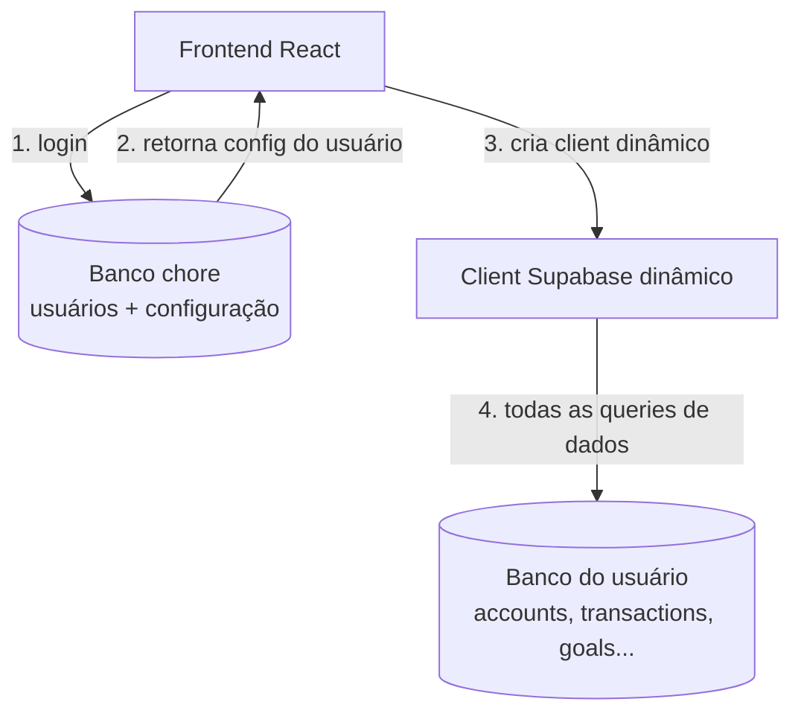

# Plano — Arquitetura multi-tenant (banco de dados por usuário)

**Data:** 2026-07-02
**Status:** Rascunho para discussão — nenhuma spec foi gerada ainda
**Escopo deste documento:** roadmap completo da transformação para multi-tenant + detalhamento da Etapa 1 (frontend agnóstico ao banco)

---

## 1. Contexto atual

Hoje o Lab Finanças é single-tenant:

- Um único projeto Supabase (`cutjwwnwfyfidkxqgjdk`) serve autenticação e dados ao mesmo tempo.
- `src/lib/supabase.ts` exporta um client singleton, criado uma vez a partir de `VITE_SUPABASE_URL` / `VITE_SUPABASE_ANON_KEY`.
- Esse singleton é importado diretamente pelos hooks de dados (`useAccounts`, `useTransactions`, `useCategories`, `useGoals`) e também por pelo menos uma página (`Dashboard.tsx`), o que já hoje quebra a regra de arquitetura documentada em `architecture.md` ("Supabase nunca é chamado diretamente em páginas/componentes — sempre via hooks").
- Autenticação é GitHub OAuth via Supabase Auth do próprio projeto, com um gate hardcoded por e-mail único (`VITE_ALLOWED_EMAIL`) dentro de `useAuth.tsx`. Esse gate é, literalmente, o mecanismo que hoje torna o app single-user.

Esse ponto de partida importa porque boa parte do trabalho de tornar o frontend "agnóstico" já está favorecida pelo padrão de hooks existente — a exceção principal é o `Dashboard.tsx`, que precisa ser corrigido junto.

---

## 2. Visão alvo

- Um projeto Supabase central — o banco **chore** — guarda o catálogo de usuários e a configuração de qual banco de dados pertence a cada um.
- Cada usuário tem seu próprio projeto Supabase dedicado, com o schema financeiro completo (`accounts`, `transactions`, `categories`, `goals`, etc.), isolado dos demais — nenhum dado de um usuário nunca trafega pelo banco de outro.
- No login, o app resolve — a partir do banco chore — qual projeto/credenciais pertencem àquele usuário, e a partir daí todas as chamadas de dados da sessão miram nesse projeto individual.

O diagrama acima (renderizado na conversa) mostra esse fluxo. Versão portátil em Mermaid, para colar direto no repositório:



---

## 3. Roadmap completo

| Etapa | Nome | Resumo |
|---|---|---|
| 0 | Baseline atual | Single-tenant, projeto único, gate por e-mail. Já existe. |
| **1** | **Frontend agnóstico ao banco** | **Foco deste documento.** O client Supabase deixa de ser um singleton estático e passa a ser resolvido dinamicamente via contexto/provider. Zero mudança de comportamento visível — hoje a config ainda vem do `.env`, mas a arquitetura fica pronta para trocar a fonte da config sem tocar em hooks ou páginas. |
| 2 | Banco chore — schema e provisionamento inicial | Desenhar e criar o schema do banco central (`users`, `user_databases`, etc.), aplicar migrations, popular com o próprio Granja apontando para o banco atual. |
| 3 | Autenticação e resolução multi-tenant | Decidir onde o login roda (ver decisões em aberto, seção 6) e implementar o fluxo real: login → busca em `chore.user_databases` → resolve config → inicializa client de dados daquele usuário. |
| 4 | Provisionamento de novos usuários | Processo (manual ou semi-automatizado) para criar um novo projeto Supabase por usuário, rodar as migrations do schema financeiro nesse projeto novo, e registrar no banco chore. |
| 5 | Migração dos dados existentes | Mover os dados atuais de Granja para o seu projeto "pessoal" definitivo (se for diferente do projeto usado hoje) e cadastrá-lo no chore. |
| 6 | Hardening e operação | Revisão de RLS/policies por projeto, rotação de chaves, tratamento de projeto pausado (free tier do Supabase pausa projetos inativos), testes end-to-end multi-tenant, observabilidade. |

Cada etapa a partir da 2 deve virar seu próprio documento de plano quando chegar a vez — este documento não tenta especificar etapas 2–6 em nível de task, só contextualiza o destino final.

---

## 4. Etapa 1 em detalhe — Frontend agnóstico ao banco

### 4.1 Objetivo

Nenhuma mudança de comportamento visível: o app continua funcionando exatamente como hoje, apontando para o mesmo projeto Supabase de sempre. O que muda é a arquitetura interna — o client Supabase deixa de ser importado como singleton estático e passa a ser resolvido via um provider/contexto, isolado atrás de uma abstração de configuração. Isso prepara o terreno para a Etapa 3 sem exigir retrabalho nela.

### 4.2 Não-objetivos (fora de escopo agora)

- Criar ou alterar o banco chore.
- Mudar o fluxo real de login ou remover o gate por `VITE_ALLOWED_EMAIL`.
- Alterar RLS, políticas ou schema de qualquer banco.
- Qualquer mudança visual ou de UX.
- Telas de gestão de usuários.

### 4.3 Decisões de arquitetura

**a) `src/lib/supabase.ts` vira uma factory, não mais um singleton eager.**
Hoje: `export const supabase = createClient(url, key)`, executado uma vez no import do módulo.
Depois: `export function createSupabaseClient(config: DatabaseConfig) { return createClient(config.url, config.anonKey) }` — só cria o client quando alguém chama, com a config que receber.

**b) A fonte da configuração fica atrás de uma interface (`DatabaseConfigResolver`).**
Novo arquivo `src/lib/database-config-resolver.ts`, com:
- `type DatabaseConfig = { url: string; anonKey: string }`
- `interface DatabaseConfigResolver { getConfig(): Promise<DatabaseConfig> }`
- `class EnvDatabaseConfigResolver implements DatabaseConfigResolver` — implementação da Etapa 1, lê `import.meta.env.VITE_SUPABASE_URL` / `VITE_SUPABASE_ANON_KEY`, comportamento idêntico ao atual.

Na Etapa 3, essa implementação é trocada por uma que busca a config no banco chore — nenhum hook ou página precisa mudar quando isso acontecer, porque todos consomem o client já resolvido via contexto, nunca o resolver diretamente.

**c) Novo `DatabaseProvider` + `useSupabaseClient()`.**
Novo arquivo `src/hooks/useDatabase.tsx`, seguindo o mesmo padrão já usado em `useAuth.tsx` (Context + Provider + hook que lança erro se usado fora do provider):
- `DatabaseProvider`: no mount, chama o resolver, cria o client via `createSupabaseClient()`, guarda em estado. **Não renderiza `children` até o client estar pronto** — mostra uma tela de carregamento (mesmo padrão visual já usado em `PrivateRoute`) enquanto resolve. Isso é o ponto mais importante da mudança: garante que nenhum hook downstream (nem o próprio `AuthProvider`) jamais precise lidar com `client === null`.
- `useDatabase()`: retorna `{ client }` do contexto.
- `useSupabaseClient()`: atalho que retorna só `useDatabase().client`, para manter os hooks de dados enxutos — `const supabase = useSupabaseClient()` no topo de cada hook, no lugar do `import { supabase } from '@/lib/supabase'` de hoje.

**d) Ordem dos providers em `main.tsx` importa.**
```tsx
<DatabaseProvider>
  <AuthProvider>
    <RouterProvider router={router} />
  </AuthProvider>
</DatabaseProvider>
```
`DatabaseProvider` por fora: como ele só libera `children` depois que o client existe, tudo que está dentro — incluindo `AuthProvider`, que também vai passar a depender de `useSupabaseClient()` para chamar `supabase.auth.*` — já recebe um client pronto. `PrivateRoute` não precisa de nenhuma mudança nessa etapa.

**e) Estabilidade referencial do client.**
Como hooks hoje têm `supabase` como valor "estável" implicitamente (é um import estático), ao passar a vir do contexto ele precisa continuar sendo a mesma referência entre renders — senão qualquer `useEffect`/`useCallback` que o tenha como dependência entra em loop de re-fetch. O `DatabaseProvider` deve criar o client uma única vez (guardado em `useState`, nunca recriado a cada render).

### 4.4 Mapa de arquivos afetados

```
NOVO   src/lib/database-config-resolver.ts   # DatabaseConfig, DatabaseConfigResolver, EnvDatabaseConfigResolver
MODIFICA src/lib/supabase.ts                  # singleton → factory createSupabaseClient(config)
NOVO   src/hooks/useDatabase.tsx              # DatabaseProvider + useDatabase + useSupabaseClient
MODIFICA src/main.tsx                         # envolve a árvore com <DatabaseProvider>
MODIFICA docs/superpowers/architecture.md     # atualiza a regra do client Supabase
MODIFICA CLAUDE.md                            # idem, se a regra estiver duplicada lá

MODIFICA src/hooks/useAuth.tsx                # import estático → useSupabaseClient()
MODIFICA src/hooks/useAccounts.ts             # idem
MODIFICA src/hooks/useTransactions.ts         # idem
MODIFICA src/hooks/useCategories.ts           # idem
MODIFICA src/hooks/useGoals.ts                # idem
MODIFICA src/pages/Dashboard.tsx              # remove import direto de supabase (débito pré-existente)

MODIFICA src/test/mocks/supabase.ts           # mock passa a expor também um useSupabaseClient mockado
MODIFICA *.test.ts(x) que hoje fazem vi.mock('@/lib/supabase', ...)
```

> **Atenção:** esta lista reflete o que está indexado no momento da escrita deste plano. Antes de transformar cada spec em tasks reais, é preciso rodar `project_knowledge_search` de novo (e idealmente um grep por `from '@/lib/supabase'` no repo) para confirmar se surgiram hooks novos desde então (ex: `useBudgets`, `useCreditCards`, algum `useDashboard` extraído do redesign recente) ou se `Dashboard.tsx` já foi refatorado para não importar o client direto. Isso segue a regra já estabelecida de sempre validar contra o project knowledge antes de escrever cada task.

### 4.5 Divisão proposta em specs

Respeitando o limite de 5 tasks por spec e uma task por arquivo:

**Spec 1.A — Infraestrutura do client dinâmico** (não migra nenhum hook ainda, só cria a fundação)
1. `src/lib/database-config-resolver.ts` — novo — `> Review: sim`
2. `src/lib/supabase.ts` — singleton → factory — `> Review: sim`
3. `src/hooks/useDatabase.tsx` — novo, Provider + hooks — `> Review: sim`
4. `src/main.tsx` — envolver com `DatabaseProvider` — `> Review: não`
5. `docs/superpowers/architecture.md` + `CLAUDE.md` — atualizar a regra do client — `> Review: não`

**Spec 1.B — Migração dos hooks e páginas para o client dinâmico**
1. `src/hooks/useAuth.tsx` — `> Review: sim`
2. `src/hooks/useAccounts.ts` — `> Review: não` (mudança mecânica)
3. `src/hooks/useTransactions.ts` — `> Review: não`
4. `src/hooks/useCategories.ts` + `src/hooks/useGoals.ts` (agrupados — mesma mudança mecânica pequena nos dois) — `> Review: não`
5. `src/pages/Dashboard.tsx` (e qualquer outro arquivo fora de `hooks/` que ainda importe `supabase` direto, a confirmar na auditoria) — `> Review: sim`

**Spec 1.C — Infraestrutura de testes**
1. `src/test/mocks/supabase.ts` — expor mock de `useSupabaseClient`/`useDatabase` — `> Review: sim`
2–5. Atualizar os arquivos de teste que hoje fazem `vi.mock('@/lib/supabase', () => import('@/test/mocks/supabase'))` (`useAccounts.test.ts`, `useTransactions.test.ts`, `useGoals.test.ts`, `Dashboard.test.tsx`, e possivelmente outros — confirmar na auditoria). Se passar de 4 arquivos, vira Spec 1.C + 1.D.

Todas as três specs são sequenciais entre si (1.B depende de 1.A existir; 1.C depende de 1.B para saber exatamente o que os mocks precisam simular). Dentro de cada spec, as tasks de hooks (accounts/transactions/categories/goals) podem rodar em paralelo entre si — arquivos distintos, sem dependência de output.

### 4.6 Riscos e pontos de atenção

- **Ordem dos providers:** inverter `DatabaseProvider` e `AuthProvider` em `main.tsx` quebra a aplicação inteira silenciosamente (auth tentaria usar um client que não existe ainda).
- **Blast radius dos testes:** se o mock não for atualizado corretamente, muitos testes quebram ao mesmo tempo. Tratar como spec própria (1.C) e rodar `npx vitest run` completo antes de comitar, não só os arquivos tocados.
- **Estabilidade do client:** ver item 4.3-e — se o `DatabaseProvider` recriar o client a cada render, qualquer hook com `supabase` em array de dependências entra em loop.
- **Lista de hooks pode estar incompleta:** ver aviso na seção 4.4 — confirmar antes de fechar a Spec 1.B.

### 4.7 Critérios de aceite da Etapa 1

- `tsc --noEmit` sem erros.
- Toda a suíte de testes passa (`npx vitest run`).
- App builda e funciona exatamente como hoje — login, navegação e dados idênticos ao comportamento atual, mesmo projeto Supabase de sempre.
- Nenhum arquivo fora de `src/lib/supabase.ts` importa `createClient` de `@supabase/supabase-js` diretamente.
- Nenhum hook ou página importa um client Supabase estático — todos usam `useSupabaseClient()`.
- Regra de arquitetura em `architecture.md`/`CLAUDE.md` atualizada e coerente com o novo padrão.

---

## 5. Decisões em aberto para as próximas etapas

Estas não bloqueiam a Etapa 1, mas vale já ter em mente porque moldam a Etapa 3 em diante:

1. **Onde a autenticação roda.** Duas opções: (a) Auth centralizado no banco chore — mais simples de operar (só um provider OAuth para configurar), mas exige que o chore saiba autenticar todo mundo antes de saber qual banco cada um usa; (b) Auth em cada projeto de usuário — mais isolado, mas exige configurar GitHub OAuth em cada projeto novo criado na Etapa 4. Recomendação inicial: (a), auth centralizado no chore, com o `user_id` do chore usado como chave para buscar a config do banco de dados pessoal.
2. **Futuro do `VITE_ALLOWED_EMAIL`.** Esse gate deixa de fazer sentido quando existir uma tabela real de usuários no chore — a validação passa a ser "esse usuário existe e tem uma config de banco associada", não mais um e-mail hardcoded.
3. **Projetos Supabase gratuitos pausam após inatividade.** Se cada usuário novo ganhar um projeto free tier, o primeiro acesso depois de um tempo parado pode demorar para "acordar" o projeto — vale considerar no dimensionamento da Etapa 4 (ou já decidir usar um plano pago para os projetos de usuário).
4. **Schema definitivo do banco chore.** Este documento assume uma tabela `users` e uma `user_databases` (ou nome equivalente) só como rascunho conceitual para o diagrama — o desenho formal (colunas, constraints, RLS) fica para a Etapa 2, quando fizer sentido usar a skill de arquitetura de banco de dados para fechar isso com mais rigor.

---

## 6. Próximos passos imediatos

1. Validar este plano — em especial a divisão em Specs 1.A/1.B/1.C e a decisão de gate de loading no `DatabaseProvider`.
2. Rodar a auditoria mencionada na seção 4.4 (grep + `project_knowledge_search` fresco) para fechar a lista exata de arquivos antes de gerar as specs de verdade.
3. Gerar a Spec 1.A seguindo o template padrão do projeto.
